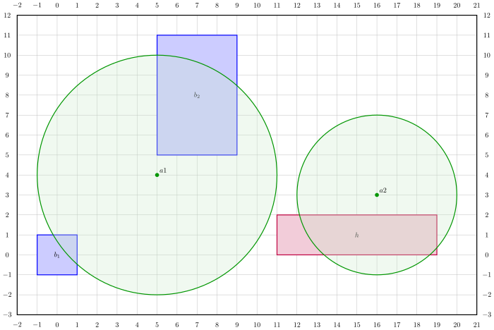

# `kover`: gestion du positionnement d'antennes de communication

Ce dépôt contient les fichiers nécessaires à la construction d'une application
en ligne de commande appelée `kover`, qui vise à optimiser le positionnement
d'antennes de communication pour une zone donnée.

## Introduction

L'application `kover` est une application en ligne de commande qui facilite le
positionnement d'*antennes* de communication dans une *scène* afin de desservir
des clients de façon adéquate. Les emplacements des clients sont représentés
par des constructions de type *building* ou *maison* (en anglais, *house*), qui
correspondent simplement à des boîtes rectangulaires.

Le flux de texte suivant décrit une scène valide composée de deux buildings
(identifiés par `b1` et `b2`), d'une maison (identifiée par `h`) et de deux
antennes (identifiées par `a1` et `a2`):

```
begin scene
  building b1 0 0 1 1
  building b2 7 8 2 3
  house h 15 1 4 1
  antenna a1 5 4 6
  antenna a2 16 3 4
end scene
```

Une représentation graphique de la scène ci-haut est disponible dans le fichier
SVG suivant:



Plus formellement, une construction se caractérise par les éléments suivants:

* `id`: un *identifiant* unique, sous forme de chaîne de caractères;
* `type`: un *type* de construction (*building* ou *house*);
* `x` et `y`: une *position* $`(x,y)`$ dans le plan, sous forme de deux entiers
  (négatifs, nuls ou positifs);
* `w` et `h`: une *demi-largeur* et une *demi-hauteur* $`(w, h)`$, qui sont
  des entiers strictement positifs.

Ainsi, les 4 points du rectangle déterminé par une construction sont $`(x - w,
y - h)`$, $`(x + w, y - h)`$, $`(x - w, y + h)`$ et $`(x + w, y + h)`$.

Une *antenne* est représentée par les éléments suivants:

* `id`: un *identifiant* unique, sous forme de chaîne de caractères;
* `x` et `y`: une *position* $`(x,y)`$ dans le plan, sous forme de deux entiers
  (négatifs, nuls ou positifs);
* `r`: un rayon (ou une *portée*) $`r`$, qui est un entier strictement
  positif.

Ainsi, une construction ne peut pas avoir une aire nulle, alors qu'une antenne
a toujours une portée décrivant un disque d'aire strictement positive.
Finalement, une *scène* est représentée par les éléments suivants:

* `constructions`: une collection de constructions
* `antennas`: une collection d'antennes

De plus, les constructions d'une scène valide ne se chevauchent pas,
c'est-à-dire qu'une scène ne peut contenir deux constructions dont
l'intersection occupe une aire non nulle. De plus, les antennes occupent des
positions distinctes.

Pour décrire une scène à l'aide d'un flux de texte, on convient d'utiliser une
syntaxe spécifique:

1. La première ligne du texte doit correspondre à l'expression régulière
   étendue (ERE) `^begin scene$`;
2. La dernière ligne du texte doit correspondre à l'ERE `^end scene$`;
3. Chaque ligne entre la première ligne et la dernière ligne doit être une
   ligne de type *building*, de type *house* ou de type *antenne*;
4. Une ligne de type *building* doit correspondre à l'ERE
   `^[:blank:]*building ID X Y W H[:blank:]*$`,
   où
    * `ID` est l'identifiant du building,
    * (`X`, `Y`) est la position du building, `X` et `Y` étant des nombres
      entiers et
    * (`W`, `H`) est une paire de demi-largeur et demi-hauteur, `W` et `H`
      étant des nombres entiers strictement positifs;
5. Une ligne de type *maison* doit correspondre à l'ERE
   `^[:blank:]*house ID X Y W H[:blank:]*$`,
   où
    * `ID` est l'identifiant de la maison,
    * (`X`, `Y`) est la position de la maison, `X` et `Y` étant des nombres
      entiers et
    * (`W`, `H`) est une paire de demi-largeur et demi-hauteur, `W` et `H`
      étant des nombres entiers strictement positifs;
6. Une ligne décrivant une antenne correspondre à l'ERE
   `^[:blank:]*antenna ID X Y R[:blank:]*$`,
   où
    * `ID` est l'identifiant de l'antenne,
    * (`X`, `Y`) est la position de l'antenne, où `X` et `Y` sont des nombres
      entiers et
    * `R` est la portée de l'antenne, qui est un nombre entier strictement
      positif.

Le programme reconnaît les identifiants et les nombres entiers selon les
contraintes suivantes:

* Un *identifiant* est une chaîne de caractères qui a une correspondance
  complète avec l'ERE `[a-zA-Z_][a-zA-Z0-9_]*`;
* Un *entier* est une chaîne de caractères qui a une correspondance complète
  avec l'ERE `0|([-]?[1-9][0-9]*)`;
* Un *entier strictement positif* est une chaîne de caractères qui a une
  correspondance complète avec l'ERE `[1-9][0-9]*`;

Des exemples de scènes valides et invalides sont donnés dans le répertoire
[`examples`](examples).

L'application `kover` permet donc de manipuler des scènes et vise à optimiser
le positionnement d'antennes dans ces scènes afin de couvrir adéquatement les
constructions qui occupent cette scène.

## Installation

### Dépendances

La construction de l'application dépend des composantes suivantes:

* [GCC](https://gcc.gnu.org/): le compilateur C de GNU. Celui-ci peut être
  installé à l'aide d'un gestionnaire de paquets
* [Make](https://www.gnu.org/software/make/): un outil en ligne de commande
  facilitant la mise en place de tâches automatiques. Cet outil peut aussi être
  installé à l'aide d'un gestionnaire
  de paquets.
* [Bats](https://github.com/bats-core/bats-core): une suite d'application
  facilitant la mise en place de tests unitaires shell. Il n'est pas nécessaire
  d'installer Bats, qui est livré avec ce dépôt dans le répertoire `bats`

### Construction (*build*)

Une fois les dépendances installées, on peut compiler l'application `kover`
à l'aide de la commande `make`:

```sh
$ make
# Ou de façon équivalente
$ make build
```

Cette commande produit entre autres l'exécutable principal `kover` dans le
répertoire `bin`.

Il est possible en tout temps de nettoyer les fichiers générés, incluant l'exécutable, à l'aide de la commande suivante:

```sh
$ make clean
```

### Tests

On peut aussi lancer la suite de tests Bats à l'aide de `make`:

```sh
$ make test
```

Un rapport Bats est alors affiché sur la sortie standard.

## Utilisation

L'application `kover` supporte actuellement 5 sous-commandes.

Elles sont présentées en ordre alphabétique dans les sous-sections suivantes.

### `kover bounding-box`

La sous-commande `bounding-box` retourne les dimensions de la boîte englobante
d'une scène lue sur l'entrée standard. Par exemple

```sh
$ kover bounding-box < examples/1b1a.scene
bounding box [-3, 7] x [-2, 8]
```

### `kover describe`

La sous-commande `describe` permet de décrire en détails le contenu d'une scène
lue sur l'entrée standard. Par exemple

```sh
$ kover describe < examples/1b1a.scene
A scene with 1 building and 1 antenna
  building b1 at 0 0 with dimensions 1 1
  antenna a1 at 2 3 with range 5
```

### `kover help`

Pour afficher l'aide, il suffit d'entrer la commande suivante:

```sh
$ kover help
```

### `kover quality`

La sous-commande `quality` rapport sur la sortie standard la qualité de
couverture des constructions d'une scène donnée. Cette qualité est représentée
comme suit:

- `A`: chacun des quatre coins de la construction est couvert
- `B`: exactement trois coins sur quatre de la construction sont couverts
- `C`: exactement deux coins sur quatre de la construction sont couverts
- `D`: exactement un coin sur quatre de la construction est couvert
- `E`: aucun des quatre coins de la construction n'est couvert

Par exemple

```sh
$ kover quality < examples/1b1a_3corners.scene
building b: B
```

### `kover summarize`

On peut en tout temps avoir un résumé de la scène lue sur l'entrée standard
à l'aide de la sous-commande `summarize`. Par exemple

```sh
$ kover summarize < examples/1b1a.scene
A scene with 1 building and 1 antenna
```

### `kover validate`

On peut en tout temps vérifier si une scène lue sur l'entrée standard est
valide à l'aide de la sous-commande `validate`:

```sh
$ kover validate < examples/empty.scene
ok
$ kover validate < examples/first_line.invalid
not ok
error: first line must be exactly 'begin scene'
```
